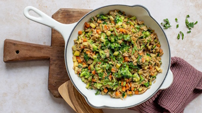

# Bratreis mit Ei und Gemüse

[Quelle](https://www.ndr.de/ratgeber/kochen/rezepte/bratreis-mit-ei-und-gemuese,bratreis-102.html)

## Zutaten

- 240 g Vollkornreis
- 2 Zehen Knoblauch
- 2 Stücke (daumengroß) Ingwer
- 4 kleine Karotten
- 2 kleine Zucchini
- 400 g Brokkoliröschen
- 4 EL Rapsöl (alternativ: Olivenöl)
- 4 EL Tamari (alternativ: Sojasoße)
- 4 Eier
- Salz & Pfeffer
- Kräuter der Provence
- Frisch gehackte Kräuter (z. B. Schnittlauch) zum Garnieren

## Zubereitung

1. **Reis kochen:** Den Vollkornreis in der doppelten Menge Salzwasser nach Packungsanweisung gar kochen.
2. **Vorbereiten:** Knoblauch schälen und fein hacken. Ingwer schälen und fein reiben. Karotten und Zucchini waschen, putzen und in Würfel schneiden. Brokkoli waschen und in **kleine** mundgerechte Röschen teilen.
3. **Anbraten:** Öl in einer großen Pfanne erhitzen. Knoblauch und Ingwer darin etwa 1 Minute anrösten.
4. **Dünsten:** Das vorbereitete Gemüse hinzufügen und abgedeckt bei mittlerer Hitze 7 Minuten dünsten, bis es bissfest ist.
5. **Braten:** Den gekochten Reis und die Tamari-Soße unter das Gemüse mischen. Alles weitere 5 Minuten braten, bis der Reis leicht knusprig wird.
6. **Eier hinzufügen:** Die Eier in einer Schale verquirlen, in die Pfanne geben, kurz stocken lassen und dann unter den Reis rühren.
7. **Abschmecken:** Mit Salz, Pfeffer und Kräutern der Provence würzen. Mit frisch gehackten Kräutern garniert servieren.

## Tipp

Ballaststoffreicher wird das Rezept, wenn man abgekühlten Reis vom Vortag verwendet. Denn beim Abkühlprozess entsteht resistente Stärke. Sie kann den Blutzuckerspiegel stabilisieren, das Sättigungsgefühl verlängern und unterstützt eine gesunde Darmflora.

## Nährwerte (pro Portion)

- ca. 458 kcal
- 19 g Eiweiß
- 18 g Fett
- 56 g Kohlenhydrate
- 7 g Ballaststoffe
