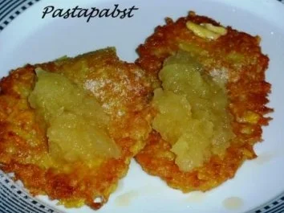

# Kartoffelpuffer mit Apfelmus

**Quelle:** <https://www.kochbar.de/rezept/335192/Kartoffelpuffer-mit-Apfelmus.html>

## Eckdaten

- **Portionen:** 3
- **Zeitaufwand:** ca. 30 Min.
- **Schwierigkeitsgrad:** einfach

## Zutaten

- 600 g Kartoffeln
- 1 Zwiebel
- 3 Eier
- 2 EL Mehl
- 1 TL Salz
- etwas Apfelmus

## Zubereitung

1. Kartoffeln schälen und grob reiben. Die geriebenen Kartoffeln in ein sauberes Geschirrtuch geben und gut ausdrücken, um überschüssige Flüssigkeit zu entfernen.
2. Zwiebel fein würfeln und zu den ausgedrückten Kartoffeln geben.
3. Eier, Mehl und Salz hinzufügen und alles gut vermischen.
4. Öl in einer großen Pfanne erhitzen. Aus der Kartoffelmasse portionsweise kleine Fladen formen und von beiden Seiten goldbraun braten.
5. Die fertigen Kartoffelpuffer auf Küchenpapier abtropfen lassen.
6. Die Kartoffelpuffer mit Apfelmus anrichten und sofort servieren.

---

**Hinweis zur Portionierung:** Die oben genannten Mengen beziehen sich auf 3 Personen. Die Zutaten können je nach gewünschter Personenanzahl proportional umgerechnet werden.
